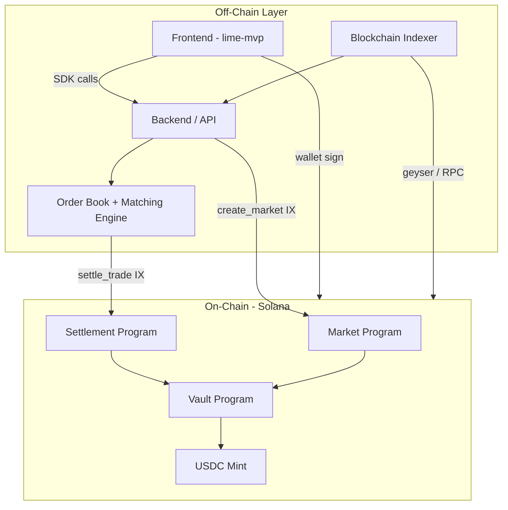
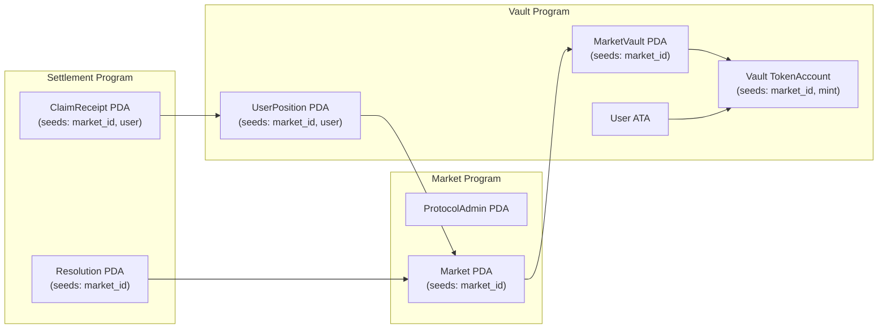
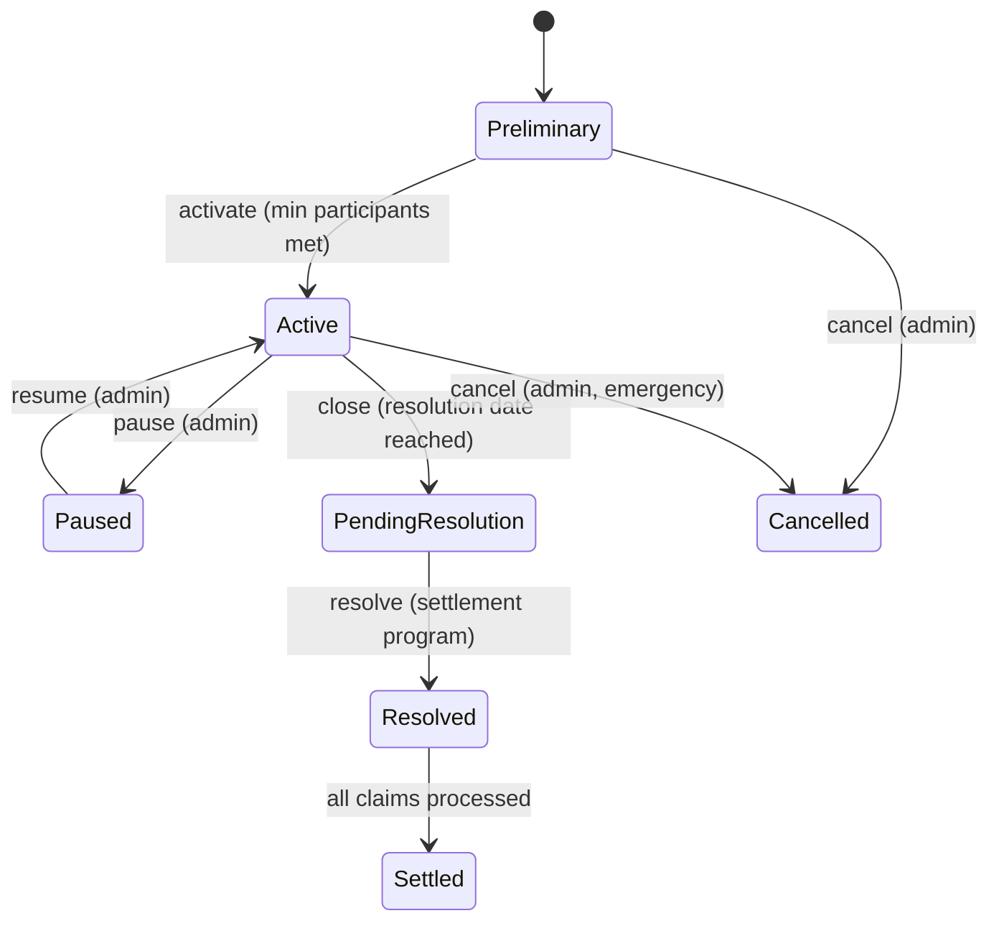

# LIME On-Chain Implementation Plan

## Context

The `lime-onchain` repo is empty. The frontend (`lime-mvp`) already defines the interfaces we must satisfy in `[src/services/wallet.ts](../lime-mvp/src/services/wallet.ts)`: `WalletProvider`, `OnchainCollateral`, `OnchainSettlement`, and `SolanaConfig`. The domain model (Market, Order, Position, Trade, PayoffCurve) is defined in `[src/lib/types.ts](../lime-mvp/src/lib/types.ts)`. Our job is to build the on-chain programs and SDK that implement those contracts on Solana.

## Architecture Overview

**Hybrid model**: matching/order book stays off-chain (backend), while collateral, positions, and settlement live on-chain.



**Why hybrid?** Fully on-chain CLOBs on Solana (Phoenix, OpenBook) work for liquid pairs but face latency issues for niche markets. LIME's capped contracts have discrete lifecycle events (create, trade, resolve, claim) -- the matching can be off-chain while the financial integrity (collateral lock, position minting, payout) stays on-chain. This gives CEX-like UX with on-chain trust guarantees.

## Key Scalability Decisions

1. **Sharded PDAs, no global state accounts** -- each Market, each user Position, each Vault is its own PDA. Solana's runtime parallelizes transactions that touch different accounts, so sharding eliminates serialization bottlenecks. This is critical for Firedancer compatibility.
2. **Zero-copy deserialization** (`#[account(zero_copy)]`) for large market state accounts to minimize compute units.
3. **Stored bump seeds** -- every PDA stores its bump at init to avoid `find_program_address` recalculation (saves 10-20K CU per call).
4. **Fixed-length seeds** (Pubkeys, u64) instead of variable-length strings.
5. **Modular programs** -- three separate Anchor programs (market, vault, settlement) with CPI between them. This allows independent upgrades and audit scope isolation.
6. **Cranked settlement** -- resolution is a two-step process (submit oracle value, then batch-process payouts) so that high-participant markets don't blow compute limits in a single TX.

## Account Architecture



### Key Accounts

| Account          | Seeds                           | Stores                                                                             |
| ---------------- | ------------------------------- | ---------------------------------------------------------------------------------- |
| `ProtocolConfig` | `["protocol"]`                  | admin pubkey, fee bps, pause flag                                                  |
| `Market`         | `["market", market_id]`         | L, U, resolution_date, status, oracle_source, payoff_type, total_long, total_short |
| `MarketVault`    | `["vault", market_id]`          | bump, total_collateral, token_account ref                                          |
| `UserPosition`   | `["position", market_id, user]` | side, quantity, avg_price, collateral_locked                                       |
| `Resolution`     | `["resolution", market_id]`     | observed_value, resolved_at, resolver pubkey                                       |
| `ClaimReceipt`   | `["claim", market_id, user]`    | payout_amount, claimed flag                                                        |

## Project Structure

```
lime-onchain/
  Anchor.toml
  Cargo.toml
  programs/
    lime-market/        # Market lifecycle (create, activate, close)
      src/
        lib.rs
        state/          # Account structs
        instructions/   # IX handlers
        errors.rs
    lime-vault/         # Collateral lock/unlock, position tracking
      src/
        lib.rs
        state/
        instructions/
        errors.rs
    lime-settlement/    # Oracle resolution, payoff calc, claim
      src/
        lib.rs
        state/
        instructions/
        errors.rs
  tests/                # Anchor TS integration tests
  sdk/                  # TypeScript SDK (@lime/solana)
    src/
      index.ts
      market.ts
      vault.ts
      settlement.ts
      types.ts
    package.json
  migrations/
```

---

## Phase 1: Project Bootstrap

- Initialize Anchor workspace with three programs (`lime-market`, `lime-vault`, `lime-settlement`)
- Configure `Anchor.toml` for localnet/devnet
- Set up Rust toolchain, Solana CLI, and Anchor CLI
- Create `ProtocolConfig` account and `initialize` instruction with admin authority
- First deploy to localnet to validate the scaffold

## Phase 2: Market Program (`lime-market`)

Core instructions:

- `**create_market**` -- Admin creates a new Market PDA with parameters: `market_id` (u64), `lower_bound` (u64, scaled), `upper_bound` (u64, scaled), `resolution_date` (i64 timestamp), `settlement_source` (string), `payoff_type` (enum: Linear, Sigmoid, Step, Convex, Concave), `min_participants` (u16). Market starts in `Preliminary` status.
- `**activate_market**` -- Transitions from `Preliminary` to `Active` once `min_participants` threshold is met. Can also be forced by admin.
- `**pause_market**` / `**resume_market**` -- Emergency circuit breaker.
- `**close_market**` -- Admin marks market as `PendingResolution`, no new trades allowed.

State machine:



Key payoff logic (on-chain, in `lime-settlement` but defined as shared lib):

```rust
pub fn calculate_payoff(
    observed: u64,
    lower: u64,
    upper: u64,
    payoff_type: PayoffType,
) -> u64 {
    if observed <= lower { return 0; }
    if observed >= upper { return SCALE; } // SCALE = 1_000_000
    let t = ((observed - lower) * SCALE) / (upper - lower);
    match payoff_type {
        PayoffType::Linear => t,
        // other curves computed with fixed-point math
        _ => t, // MVP: linear only
    }
}
```

## Phase 3: Vault Program (`lime-vault`)

Core instructions:

- `**init_market_vault**` -- Creates the vault PDA and associated token account (USDC) for a given market. Called by Market Program via CPI on `create_market`.
- `**deposit_collateral**` -- User locks USDC into the vault. Creates/updates a `UserPosition` PDA. The collateral amount = `quantity * SCALE` (full collateralization for max payout).
- `**withdraw_collateral**` -- User withdraws unlocked collateral (only from cancelled markets or after claim).
- `**settle_trade**` -- Called by the off-chain matching engine (via backend signer). Atomically: (1) debits buyer's free collateral, (2) credits seller's free collateral, (3) updates both `UserPosition` accounts with new quantities/avg prices. This is the critical scalability instruction.

Scalability considerations for `settle_trade`:

- Each trade touches exactly 2 `UserPosition` PDAs + 1 `MarketVault` -- Solana can parallelize trades across different markets.
- For trades within the same market, they serialize on the `MarketVault` account. If this becomes a bottleneck at high volume, we can shard vaults per price range or use a "batch settle" instruction that processes multiple trades in one TX (up to compute limit).
- The backend signer (cranker) batches trades and submits them in parallel transactions across different markets.

## Phase 4: Settlement Program (`lime-settlement`)

Core instructions:

- `**submit_resolution**` -- Oracle/admin submits the observed value for a resolved market. Creates a `Resolution` PDA. Validates the market is in `PendingResolution` status. Can support multiple oracle sources with a quorum mechanism (future).
- `**calculate_payouts**` -- Batch instruction that reads the `Resolution` and iterates over `UserPosition` PDAs to create `ClaimReceipt` PDAs with calculated payout amounts. Processes N positions per TX call (cranked).
- `**claim_payout**` -- User claims their payout. Reads `ClaimReceipt`, transfers USDC from vault to user's ATA, marks as claimed.
- `**refund**` -- For cancelled/invalid markets, returns full collateral to users.

Payout calculation (linear MVP):

```
payoff_ratio = calculate_payoff(observed, L, U, payoff_type)  // 0 to SCALE
long_payout = position.quantity * payoff_ratio / SCALE
short_payout = position.quantity * (SCALE - payoff_ratio) / SCALE
```

## Phase 5: TypeScript SDK (`@lime/solana`)

Build a TypeScript SDK that wraps all program interactions and implements the frontend interfaces:

```typescript
// Implements OnchainCollateral from lime-mvp
export class SolanaCollateral implements OnchainCollateral {
  async lockCollateral(marketId: string, amount: number): Promise<string> {
    // Build + send deposit_collateral IX
  }
  async releaseCollateral(marketId: string): Promise<string> {
    // Build + send withdraw_collateral IX
  }
  async getLockedBalance(marketId: string): Promise<number> {
    // Fetch UserPosition PDA, return collateral_locked
  }
  async getTotalLocked(): Promise<number> {
    // Fetch all UserPosition PDAs for connected wallet
  }
}

// Implements OnchainSettlement from lime-mvp
export class SolanaSettlement implements OnchainSettlement {
  async resolveMarket(
    marketId: string,
    observedValue: number,
  ): Promise<string> {
    // Build + send submit_resolution IX
  }
  async claimPayout(marketId: string): Promise<string> {
    // Build + send claim_payout IX
  }
  async getPayoutStatus(
    marketId: string,
  ): Promise<"pending" | "claimable" | "claimed"> {
    // Check Resolution + ClaimReceipt PDAs
  }
}
```

The SDK also provides:

- Market creation/querying helpers
- Event listeners (Anchor event parsing)
- IDL-generated types auto-exported
- Connection management with RPC failover

## Phase 6: Integration Tests

Comprehensive Anchor test suite covering:

1. **Happy path**: create market -> deposit collateral -> settle trades -> resolve -> claim
2. **Edge cases**: payout at L (floor), payout at U (ceiling), payout at midpoint
3. **Security**: unauthorized resolution attempt, double-claim prevention, overflow checks
4. **Cancellation**: refund flow for cancelled/invalid markets
5. **Scalability**: batch settlement of 50+ trades, batch payout calculation
6. **Fee collection**: protocol fee deduction on trade and claim

## Phase 7: Devnet Deployment and Frontend Integration

- Deploy all three programs to Solana devnet
- Update `SolanaConfig` in `lime-mvp` with real program IDs
- Replace mock singletons with real SDK implementations
- Add `@solana/wallet-adapter-react` to frontend
- End-to-end test: wallet connect -> deposit -> trade -> resolve -> claim

---

## Implementation Priority for MVP

For the MVP, we scope down to:

- **Linear payoff only** (other curves are parameterized but not computed on-chain yet)
- **Single oracle source** (admin-submitted resolution, not decentralized oracle)
- **USDC only** as collateral token
- **Admin-created markets** (no community proposals on-chain)
- **Sequential settlement** (batch optimization comes after MVP)

This gives us a working product with the core value proposition (capped continuous payoff, full collateralization, on-chain settlement) while leaving clear extension points for scale.

---

## Post-MVP Extensions

### Extension A: Position Tokenization (SPL Tokens)

In the MVP, positions are tracked as PDA accounts (`UserPosition`), which are simple and efficient but **not transferable**. For composability and secondary market liquidity, positions should eventually be represented as SPL tokens:

- Mint an SPL token per market-side combination (e.g., `LIME-OPENAI-LONG`, `LIME-OPENAI-SHORT`)
- Each token represents 1 unit of exposure to that contract's payoff
- Enables: secondary trading on Jupiter/Raydium, portfolio aggregation in wallets, DeFi composability (collateral in lending protocols)
- Implementation: add a `PositionMint` PDA per market-side, integrate `token::mint_to` on deposit and `token::burn` on claim/withdraw
- The vault program would gate redemption: only burn position tokens to claim the underlying USDC payout after resolution

This is analogous to Polymarket's Conditional Tokens (ERC1155) but using Solana's native SPL token standard.

### Extension B: Wallet Abstraction and Gasless UX

The MVP uses standard wallet adapters (Phantom, Solflare). For mass-market adoption, reduce signing friction:

- **Session Keys** (Gum Protocol pattern): user signs a one-time delegation TX, granting a temporary keypair permission to sign specific instructions (deposit, claim) for a time window. Eliminates per-action wallet popups.
- **Gas Relayer** (Octane pattern): let users pay transaction fees in USDC instead of requiring SOL in their wallet. The relayer wraps the user's instruction in a fee-paying transaction.
- **Embedded Wallets** (Privy, Dynamic, Turnkey): for email/social login onboarding, generate a wallet server-side with MPC key sharding. User never sees a seed phrase.

Priority order: Session Keys (low effort, high UX impact) > Embedded Wallets (high impact on onboarding funnel) > Gas Relayer (nice-to-have, SOL gas is already cheap).

### Extension C: Decentralized Oracle Resolution

Replace admin-submitted resolution with a trust-minimized oracle:

- **Switchboard V2 / Pyth** for price feeds (stocks, crypto, commodities) -- direct on-chain price data
- **UMA-style Optimistic Oracle** for custom metrics (ARR, box office, etc.) -- anyone can propose a value, dispute window, bond mechanism
- **Multi-source quorum**: require N-of-M oracle sources to agree before resolution is finalized
- The `submit_resolution` instruction would accept a Switchboard/Pyth account reference instead of an admin signature
